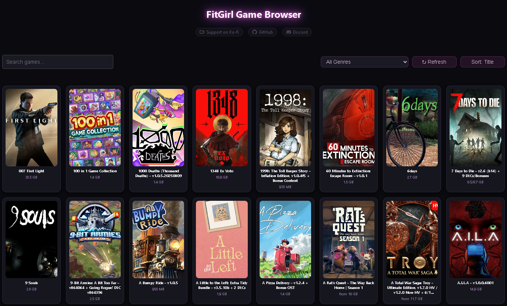

# 💜 FitGirl Game Browser

**Browse, search and grab FitGirl PC game repacks — all from one clean desktop app.**

---

## ⬇️ Download

Grab the right file for your computer from the **[Latest Release](https://github.com/NookieAI/FitGirl-Game-Browser/releases/latest)** page:

| Your computer | Download |
|---|---|
| 🪟 **Windows 10/11** | `FitGirl.Game.Browser.v*.exe` — *portable, just double-click* |
| 🍎 **Mac (Apple Silicon — M1/M2/M3/M4)** | `FitGirl.Game.Browser.v*_aarch64.app.zip` |
| 🍎 **Mac (Intel)** | `FitGirl.Game.Browser.v*_x64.app.zip` |
| 🐧 **Linux (64-bit x86)** | `FitGirl.Game.Browser.v*_amd64.AppImage` |

*The `v*` is the version number — on the current release the Windows file is `FitGirl.Game.Browser.v1.0.0.exe`.*

*Not sure which Mac you have? Apple menu → About This Mac. "Chip: Apple M1/M2/M3/M4" → Apple Silicon. "Processor: Intel" → Intel.*

---

## ✨ What it does

- 🔍 **Instant title search** — start typing and the library filters as you go
- 🏷️ **Filter by genre** — pick from the dropdown to narrow the whole library down
- 🔀 **Sort three ways** — one button, click to cycle `Sort: Title` → `Sort: Newest` → `Sort: Size`
- 📦 **Original size vs repack size** — open a game and see exactly how much space the repack saves you
- 🖼️ **Screenshots built in** — click a game for its shots, click a shot to view it full screen
- 🔗 **Download links and magnets together** — links open in your browser; magnets copy to your clipboard for your torrent app
- 🔐 **Encrypted game list** — the catalog arrives encrypted and is unscrambled in memory. It is never cached or saved to your drive.
- 🙈 **No account, no sign-in, no telemetry** — nothing to register for and no usage tracking
- ⚡ **Fast and tidy** — opens in about a second, and only one window ever runs at a time

---

## 🚀 Install

### 🪟 Windows

1. Download the `.exe`.
2. Double-click it. That's it — nothing to install, no setup wizard.
3. Windows SmartScreen may say *"Windows protected your PC"* because the app isn't code-signed. Click **More info → Run anyway**.

### 🍎 macOS

1. Download the `.app.zip` for your Mac and double-click to unzip.
2. Drag **FitGirl Game Browser** into your **Applications** folder.
3. The first launch is blocked because the app isn't notarised by Apple:
   - **macOS 14 and earlier:** right-click the app → **Open** → **Open**.
   - **macOS 15 (Sequoia) and later:** double-click it once and let it be blocked, then go to **System Settings → Privacy & Security**, scroll down to the message about FitGirl Game Browser and click **Open Anyway**.
4. You only need to do this once.

### 🐧 Linux

1. Download the `.AppImage`.
2. Make it runnable — right-click → Properties → tick *"Allow executing file as program"*, or run `chmod +x FitGirl.Game.Browser.v*_amd64.AppImage`.
3. Double-click to run.

---

## 🔄 Updates

The app checks GitHub for a newer release a few seconds after it opens.

- **Windows and macOS** — it downloads the update, checks the file's SHA-256 fingerprint against the one GitHub published, and only swaps itself over if they match. Then it restarts. Nothing needed from you.
- **Linux** — replacing a running AppImage in place isn't supported yet, so updates aren't automatic. Grab the newer `.AppImage` from the [releases page](https://github.com/NookieAI/FitGirl-Game-Browser/releases/latest) whenever you want to update.

---

## 🛠️ Troubleshooting

<b>The app doesn't open at all on Windows 10</b>

The app draws its interface using Microsoft's WebView2 runtime. Windows 11 includes it; some Windows 10 machines don't. Install the free **Microsoft Edge WebView2 Runtime** ("Evergreen Standalone Installer") from Microsoft's website, then try again.

<b>Searching for a genre or a studio finds nothing</b>

The search box matches **game titles only** — it doesn't look inside descriptions, genres or developer names. To browse by genre, use the **All Genres** dropdown next to the search box instead.

<b>The library is empty, or covers won't load</b>

The game list and its artwork are fetched when the app starts, so it needs an internet connection. Click **↻ Refresh** to try again. If your network blocks Cloudflare-hosted content, the list can't download.

<b>I clicked a magnet and my torrent app didn't open</b>

Magnet buttons **copy the link to your clipboard** — you'll see a "Magnet link copied!" message — rather than launching anything. Paste it into your torrent client.

<b>The AppImage won't start on Linux</b>

Most distributions need FUSE 2 for AppImages. On Debian/Ubuntu: `sudo apt install libfuse2`. Alternatively, run it with `--appimage-extract-and-run`.

<b>Nothing happens when I click a download link</b>

Links open in your normal web browser. If no default browser is set, the click has nowhere to go — set one in your system settings.

<b>Where does the app store anything?</b>

Only a small diagnostic log — the game list itself is never written to disk. To remove it:
- **Windows:** delete `%APPDATA%\com.nookie.fitgirlbrowser`
- **macOS:** delete `~/Library/Application Support/com.nookie.fitgirlbrowser`
- **Linux:** delete `~/.local/share/com.nookie.fitgirlbrowser`

To uninstall the app itself, just delete the file you downloaded.

---

## 💬 Support

Found a bug or want something added? Open an [issue](https://github.com/NookieAI/FitGirl-Game-Browser/issues) or say hello on Discord.

---

This app indexes and links to publicly available FitGirl Repacks. It hosts no game files itself and is not affiliated with FitGirl.

